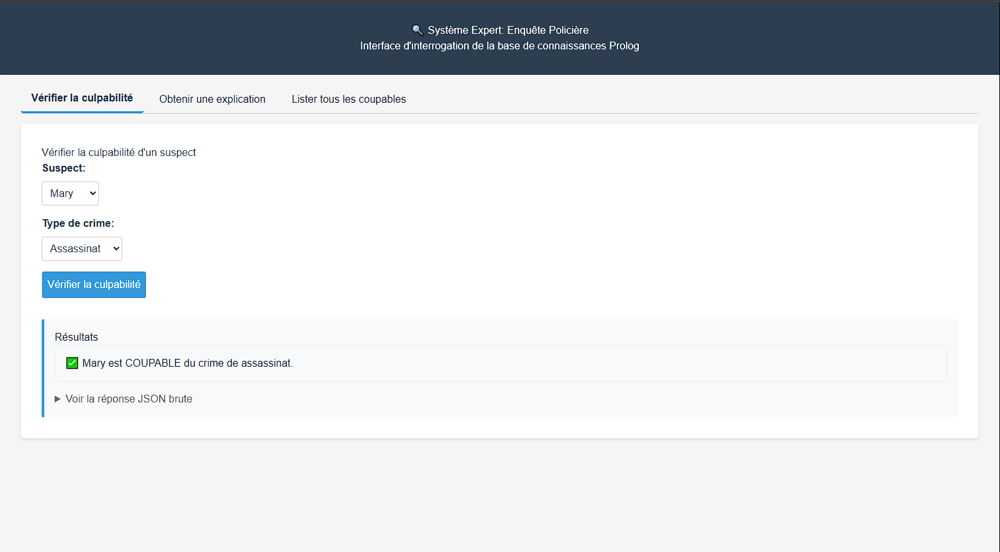
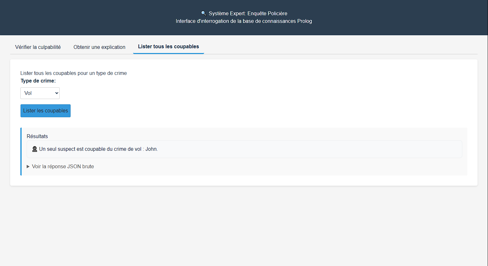
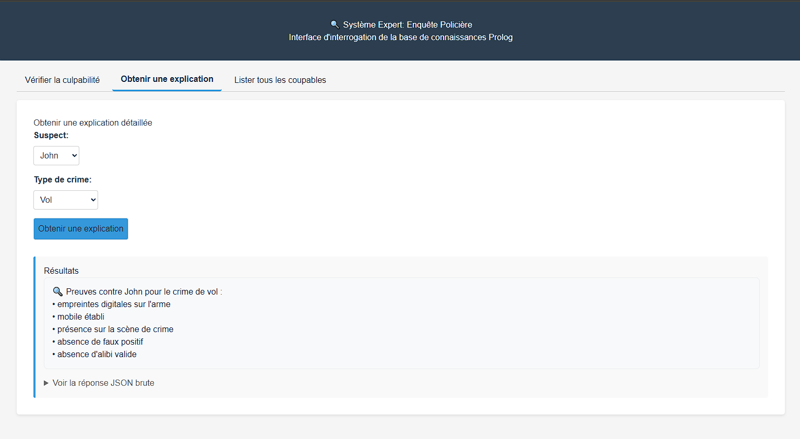

# Les membres du projet
## M1 GB Groupe 2
```
2626 RAMBOLAMANANA Fiderana Esthella
2630 RAKOTOZANDRY Herisoa Daniella
2632 ANDRIANTSILAVINA Tsiferana Heritsilavo
2639 ANDRIATOLOJANAHARY Maharo Mandampitiavana
2643 RAOELIARIJAONA Hary Miora
2720 RAFENOMANANDRAY Miralaza
2737 FENOFITIAVANA Harilalao Patricia
```

# Prolog
# Projet IA – Enquête Policière en Prolog

## Description

Ce projet est un **système expert en Prolog** pour la gestion d’enquêtes criminelles.  
Il permet de déterminer si un suspect est coupable ou innocent en fonction de preuves, témoins, alibis et indices.  
Le projet inclut la **modélisation des faits**, des règles de culpabilité, des exceptions (alibis, faux positifs, témoins non fiables), et une interface utilisateur interactive.

---

## Fonctionnalités

- Vérifier si un suspect est coupable d’un type de crime (`vol`, `assassinat`, `escroquerie`).
- Lister tous les suspects coupables d’un type de crime.
- Gestion des **cas spéciaux** :
  - Alibis
  - Faux positifs (empreintes anciennes)
  - Fiabilité des témoins
- Explication des preuves à charge pour chaque suspect.

---

## Technologies

- **Langage** : Prolog (SWI-Prolog)
- **Paradigme** : Logique déclarative, système expert
- **Module principal** : `enquete_policiere`

---

## Installation

1. Installer [SWI-Prolog](https://www.swi-prolog.org/download/stable) sur votre machine.
2. Cloner le projet :

```bash
git clone https://github.com/Maharo-Andri/Prolog.git
```

3. Se rendre dans le dossier du projet :
```
cd Prolog
```

# Application Web Next.js

Une application web moderne permet d'interroger le système expert Prolog via une interface simple et intuitive.

## Utilisation de l'application

1. Installer les dépendances Node.js :
   ```bash
   npm install
   ```
2. Lancer le serveur de développement :
   ```bash
   npm run dev
   ```
3. Accéder à l'application dans votre navigateur à l'adresse :
   ```
   http://localhost:3000
   ```
4. Utiliser les fonctionnalités :
   - Vérifier la culpabilité d'un suspect
   - Lister les suspects coupables
   - Demander une explication des preuves

## Captures d'écran

- Vérification de la culpabilité :
  
- Liste des suspects coupables :
  
- Demande d'explication :
  

---

## Exécution directe dans SWI-Prolog

1. Lancer SWI-Prolog :
   ```
   swipl
   ```
2. Charger le fichier Prolog :
   ```
   ?- [prolog].
   ```
3. Lancer le menu interactif :
   ```
   ?- enquete_policiere:main.
   ```

## Exemple de requêtes directes

Pour tester directement la culpabilité ou obtenir les preuves :
```
?- enquete_policiere:is_guilty(john, vol).
?- enquete_policiere:explain_guilt(john, vol, Evidence).
?- enquete_policiere:find_all_guilty(vol, Suspects).
```
